> 🌐 **English version**: [README.en.md](./README.en.md)

[](https://opensource.org/licenses/MIT)
[](https://docs.claude.com/en/docs/claude-code/overview)
[](https://www.skills.sh/)
[](https://github.com/huasanai/huasan-skills)

<p align="center">
  
</p>

# huasan-skills

> **画伞的 Claude Code skills 集合。每个 skill 各自在独立 repo 里有完整的 README / logo / hero / release notes。这里是一站式索引。**

一个持续演化的工具箱，覆盖 AI Coding 学习、内容生产、效率工具、基础设施搭建、个人 OS 模板五个方向。

---

## 5 大类别 · 11 个 skill

### 🎯 AI Coding · Learning

帮助非编程出身的人理解代码、读懂工具、把学习沉淀成可复用资产。

| Skill | ⭐ | 一句话 |
|---|---|---|
| [**handcode-tutor**](https://github.com/huasanai/handcode-tutor) |  | 手把手陪你练手敲代码的 AI 教练。关掉自动补全，自己敲、自己错、自己懂——AI 只在旁边讲清楚为什么 |
| [**coding-mentor**](https://github.com/huasanai/coding-mentor) |  | 非编程者的代码理解导师。看懂代码、拆解 GitHub 项目、长成 Obsidian 知识库 |
| [**ai-coding-wiki**](https://github.com/huasanai/ai-coding-wiki) |  | 面向中文非编程用户的 AI Coding 学习 Skill（Claude Code / Codex CLI）|

### 🛠 Claude Code · Tooling

针对 Claude Code 工作流的工具型 skill，提升日常使用体验。

| Skill | ⭐ | 一句话 |
|---|---|---|
| [**cc-provider-add**](https://github.com/huasanai/cc-provider-add) |  | 接入任何 Anthropic 兼容 API 端点（MiMo / GLM / Kimi 等），每个 provider 独立 `CLAUDE_CONFIG_DIR` 隔离，零二进制依赖 |
| [**conversation-logger**](https://github.com/huasanai/conversation-logger) |  | 自动把每次 Claude Code 会话保存为 Markdown — 零 Token 消耗、实时更新、兼容 Obsidian。自动捕获 build-in-public 素材 |

### 🌐 Infra · 环境搭建

| Skill / Doc | ⭐ | 一句话 |
|---|---|---|
| [**vps-vpn-setup**](https://github.com/huasanai/vps-vpn-setup) |  | Claude Code / Codex 一键部署 VPS + VPN + Clash 代理环境的 skill，省去手动 SSH 敲命令 |
| [**vps-vpn-clash-setup**](https://github.com/huasanai/vps-vpn-clash-setup) 📖 |  | ↑ 配套的保姆级教程：通过 VPS + v2ray-agent + Clash 获得干净海外 IP，降低 Claude / ChatGPT 封号风险 |

### ✍️ Content 生产

| Skill | ⭐ | 一句话 |
|---|---|---|
| [**podcast-to-md**](https://github.com/huasanai/podcast-to-md) |  | 一条小宇宙 / YouTube 链接 → 结构化中文 markdown：带说话人的逐字稿 + 摘要 + 金句 + 口播稿。免费 ASR（Groq Whisper）|
| [**artifact-html**](https://github.com/huasanai/artifact-html) |  | 把任意内容（笔记 / 知识 / 流程 / 对比 / 计划）转化为 claude.ai 风格的独立 HTML 网页，可一键导出 PNG 分享 |
| [**github-epub-productizer**](https://github.com/huasanai/github-epub-productizer) |  | 把 GitHub 书籍型 Markdown 仓库打包成可售卖数字商品 — EPUB 生成、Gemini AI 封面、商品海报渲染 |

### 📦 Template

| Skill | ⭐ | 一句话 |
|---|---|---|
| [**lifeos-template**](https://github.com/huasanai/lifeos-template) |  | 自演化的个人 OS 模板，搭配你自定义的 AI 助理，跑在 Claude Code & Codex CLI 上 |

---

## 怎么安装

**每个 skill 各自独立**——点进对应 repo 看 README，里面有完整的安装命令。绝大多数是这一行：

```bash
npx skills add huasanai/<skill-name> -g -y
```

例如：

```bash
npx skills add huasanai/handcode-tutor -g -y
npx skills add huasanai/coding-mentor -g -y
```

兼容 Claude Code / Codex CLI / Cursor / Gemini CLI 等 [skills.sh](https://www.skills.sh/) 生态 agent。

---

## Coming soon · 本地中

以下 skill 已在本地长期使用，将逐步开源到 `huasanai/*`：

- **push-github** — 项目首次推送 GitHub 的标准化打磨流程，含 Step 0 自动脱敏 + 动效 logo 风格库 + 叙事动画模式
- **learn-by-doing** — 手把手陪学新工具 + 协作沉淀成 howto 文档（铁律：先核实再开口）
- **内容生产套件** — `cta` 长文 / `oral` 口播 / `short` 短图文 / `ill` 配图 / `decode` 解读 / `refine` 微调
- **更多 ...** — 商业工具集、对外贸团队的工作流套件等

想第一时间知道？关注本仓库 → ⭐ Star + Watch。

---

## 为什么是聚合 + 独立双轨

每个 skill 都有自己完整的故事、视觉、release 节奏，**不并入同一仓库**——保留单 skill 的产品仪式感。这里只是**入口**：
- 想要全套 → 进这里，按类别选
- 想看某一个的 demo、深入文档、提 issue → 点进对应 repo

参考宝玉（[baoyu-skills](https://github.com/JimLiu/baoyu-skills)）和乔木（[qiaomu-skills](https://github.com/joeseesun/qiaomu-skills)）的做法，但选择"独立 repo + 索引聚合"的双轨而不是把所有 skill 塞进一个 repo。

---

## 支持与交流

### 联系画伞

| 平台 | 账号 |
|---|---|
| 💬 微信 | `huasanai` |
| 🐦 X | [@yfusionai](https://x.com/yfusionai) |
| 🎬 抖音 | [@画伞](https://v.douyin.com/zHu4VUhztes/) |

---

## License

MIT © 画伞 (huasan)
